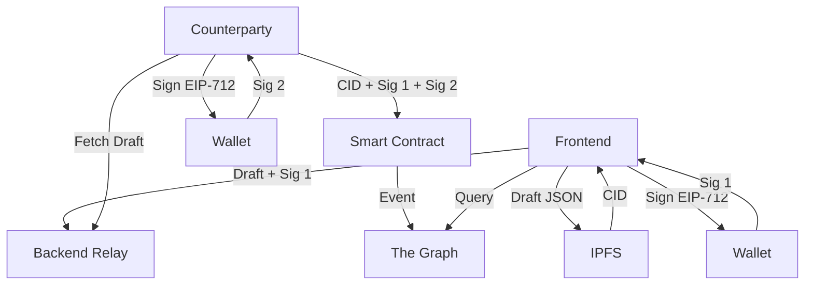

# NOD — Decentralized Handshakes & Agreements


**NOD** is a premium decentralized platform that replaces informal "text-message" agreements with cryptographically sealed, independently verifiable digital handshakes. 

By combining **Ethereum**, **IPFS**, and **Zero-Knowledge Proofs (ZK)**, Nod ensures that agreements are immutable, secure, and optionally private.

---

## 🎯 Purpose & Learning Objectives

This project serves as a comprehensive laboratory for learning modern blockchain development patterns. Through NOD, we explore:

- **Cryptographic Identity**: Moving from usernames to Ethereum addresses (`0x...`).
- **Off-Chain Storage (IPFS)**: Learning how to store large data (agreement text) efficiently using Content Identifiers (CIDs).
- **Signature Standards (EIP-712)**: Implementing human-readable typed data signing for secure user approvals.
- **On-Chain Verification**: Using `ecrecover` in Solidity to verify authorship on a trustless network.
- **Indexing (The Graph)**: Handling the "Query Problem" of blockchain by building a custom GraphQL subgraph.
- **Privacy (ZK/Noir)**: Implementing Zero-Knowledge circuits to prove the existence of an agreement without revealing its contents.

---

## 🏗️ Architecture & System Design

NOD uses a "Decentralized Hybrid" architecture to balance user experience with blockchain security.

### The "Nod" Flow
1. **Initiation**: The creator drafts an agreement. The text is hashed into a **CID** on **IPFS**.
2. **Signature 1**: The creator signs the agreement metadata (CID, Addresses, Timestamp) using **EIP-712**.
3. **Relay**: A "Thin Backend" holds the draft and the first signature temporarily.
4. **Signature 2**: The counterparty signs the same metadata.
5. **Sealing**: Either party submits both signatures to the **Nod Smart Contract**.
6. **Validation**: The contract verifies both signatures and permanently stores the agreement state.
7. **Indexing**: **The Graph** picks up the event and updates the indexed search database.



---

## 🛠️ Tech Stack

| Layer | Technology | Purpose |
| :--- | :--- | :--- |
| **Frontend** | Next.js 15, Wagmi, ConnectKit | User interface and wallet connectivity. |
| **Contracts** | Solidity 0.8.28, Hardhat | The "Source of Truth" for agreement status. |
| **Storage** | IPFS (Pinata) | Immutable storage for the full agreement text. |
| **Indexing** | The Graph (GraphQL) | High-performance queries for on-chain history. |
| **Privacy** | Noir (Aztec) | Zero-Knowledge circuits for private proof of nod. |
| **Backend** | Next.js API Routes | Timestamp issuance and temporary draft storage. |

---

## 🔐 Security & Privacy

### Security Measures
- **EIP-712 Typed Signing**: Prevents phishing by showing users exactly what they are signing in their wallet (e.g., "Agreement with 0xABC...").
- **State Machine Enforcement**: Agreements can only transition from `Awaiting` to `Nodded` or `Declined`. There is no "delete" or "edit" function.
- **Nonce-based Replay Protection**: Each initiator has a nonce that increments, preventing someone from re-submitting an old agreement.

### Privacy Strategy
Currently, agreement metadata on IPFS is public. However, we are implementing **ZK-SNARKs** via **Noir**:
- **Selective Disclosure**: Users can generate a proof that says "I have a Nodded agreement with Alice" without revealing the specific text of the agreement.
- **Commitment Hashing**: We store a commitment (hash of text + secret) on-chain instead of raw text, allowing privacy-preserving verification.

---

## 🚀 Getting Started

### 1. Prerequisites
- Node.js (v20+)
- MetaMask or Rainbow wallet.
- [Nargo](https://noir-lang.org/docs/getting_started/installation/) (if working on ZK circuits).

### 2. Installation
```bash
npm install
```

### 3. Setup Environment
Create a `.env` in the root with:
- `NEXT_PUBLIC_WALLETCONNECT_PROJECT_ID`: From WalletConnect Cloud.
- `PINATA_JWT`: From Pinata (for IPFS).
- `NEXT_PUBLIC_CONTRACT_ADDRESS`: Deployed Nod contract address.

### 4. Local Development
```bash
# Start local chain
npm run contracts:node

# Deploy contracts locally
npm run contracts:deploy

# Start frontend
npm run dev
```

---

## 🧪 Testing Methods

We maintain high confidence through a multi-layered testing approach:

- **Smart Contract Tests**: `npm run contracts:test`
  - Validates signature recovery using Ethers.js.
  - Checks state transition constraints.
- **Circuit Tests**: `nargo test` (inside `circuits/`)
  - Validates that the ZK circuit correctly constrains signatures and timestamps.
- **Frontend Integration**: Manual testing via ConnectKit on the Sepolia testnet.

---

## 🔮 Future Scope

1. **Mobile App**: Native mobile experience using WalletConnect SDK.
2. **Arbitration DAO**: A mechanism for third-party mediators to resolve disputes on-chain.
3. **Social Graphs**: Integrating Lens Protocol or Farcaster to resolve wallet addresses to social handles.
4. **Encrypted IPFS**: Using LIT Protocol to encrypt agreement text such that only participants can decrypt it.

---