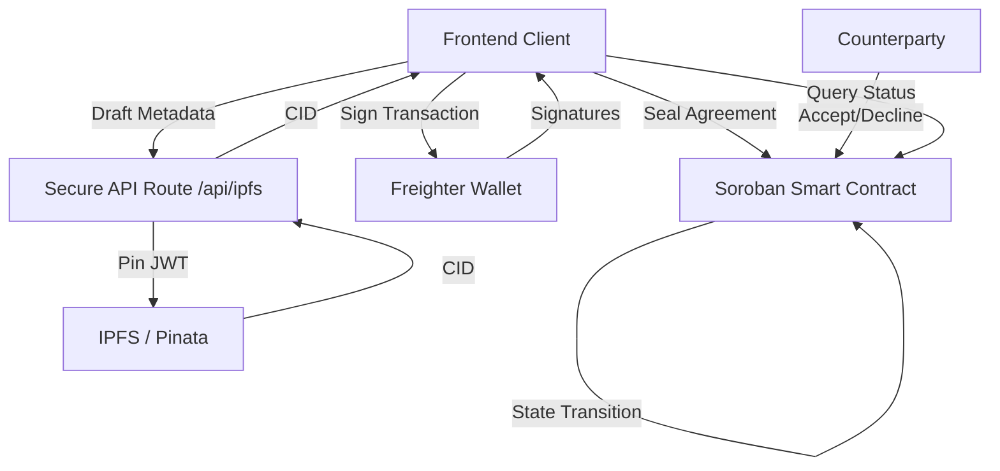

# NOD — Decentralized Handshakes & Agreements on Stellar/Soroban


[](https://nod-agreement.vercel.app/)

**NOD** is a premium decentralized platform that replaces informal "text-message" agreements with cryptographically sealed, independently verifiable digital handshakes. 

By combining **Stellar/Soroban**, **IPFS**, and **Zero-Knowledge Proofs (ZK)**, Nod ensures that agreements are immutable, secure, and optionally private.

🌐 **Live Demo**: [https://nod-agreement.vercel.app/](https://nod-agreement.vercel.app/)
🎥 **Demo Video**: [Watch Walkthrough Video](images/Recording%202026-07-26%20205027.mp4)

<video src="images/Recording%202026-07-26%20205027.mp4" width="100%" controls></video>

---

## 📸 Application Gallery

| Dashboard & Agreement Overview | Create Nod & Template Selector |
| :---: | :---: |
|  |  |

| Verification & Audit Interface | Multi-Wallet Connection Modal |
| :---: | :---: |
|  |  |

### 📱 Mobile Responsive Interface

| Mobile Dashboard | Mobile Navigation Drawer |
| :---: | :---: |
|  |  |

| Mobile Create Nod Page | Mobile Verify & Audit Page |
| :---: | :---: |
|  |  |

---

## 🎯 Purpose & Learning Objectives

This project serves as a comprehensive laboratory for learning modern blockchain development patterns on Stellar. Through NOD, we explore:

- **Cryptographic Identity**: Decoupled keys using Stellar G-addresses.
- **Off-Chain Storage (IPFS)**: Immutable storage of agreement text off-chain, linked on-chain via Content Identifiers (CIDs).
- **Soroban Smart Contracts**: Writing stateful, secure contracts in **Rust** using the **Soroban SDK**.
- **Stellar Freighter Integration**: Seamless transaction signing using the official Freighter browser extension.
- **Escrow & Caution Money**: Depositing Stellar assets (XLM/tokens) in caution-money escrows, with dispute resolution handled by arbiters.
- **Privacy (ZK/Noir)**: Implementing zero-knowledge circuits to prove the existence and parameters of an agreement without exposing private details to the public.

---

## 🏗️ Architecture & System Design

NOD uses a "Decentralized Hybrid" architecture to balance user experience with blockchain security.

### The "Nod" Flow
1. **Initiation**: The creator drafts an agreement. The frontend calls a secure backend API route `/api/ipfs` to pin the metadata securely to **IPFS** via **Pinata**, returning an immutable **CID** (`Qm...`).
2. **Cosigning**: Creator and counterparties sign the agreement.
3. **Sealing on Soroban**: The initiator submits the agreement details, including the IPFS CID, caution money (if configured), and counterparties to the **Nod Soroban Contract**.
4. **Validation**: The contract seals the agreement, locks caution money, and updates the state.
5. **Execution**: Counterparties accept or decline. Upon performance, the creator marks it delivered, and parties complete the agreement.
6. **Escrow Release**: Locked caution money is returned automatically to the parties.
7. **Disputes**: In case of breach, any party can raise a dispute, which can be resolved by a designated on-chain arbitrator.


```mermaid
graph TD
    A[Frontend Client] -->|Draft Metadata| B[Secure API Route /api/ipfs]
    B -->|Pin JWT| C[IPFS / Pinata]
    C -->|CID| B
    B -->|CID| A
    A -->|Sign Transaction| D[Freighter Wallet]
    D -->|Signatures| A
    A -->|Seal Agreement| E[Soroban Smart Contract]
    E -->|Lock Escrow| E
    F[Counterparty] -->|Accept/Decline| E
    E -->|State Transition| E
    A -->|Query Status| E
```

---

## 🛠️ Tech Stack

| Layer | Technology | Purpose |
| :--- | :--- | :--- |
| **Frontend** | Next.js 16 (Webpack Mode), Framer Motion | Premium responsive UI with custom select dropdown filters and animations. |
| **Contracts** | Soroban (Rust SDK v22.0.1) | State machine and caution escrow logic. |
| **Storage** | IPFS (Pinata) | Immutable storage for the full agreement text. |
| **Connectivity** | `@stellar/stellar-sdk`, Freighter API | Interface for transaction building and signing. |
| **Privacy (ZK)** | Noir (v1.0.0-beta.20), Barretenberg WASM | Client-side ZK-SNARK proof generation/verification. |
| **Backend Relay** | Next.js API Routes | Secure Pinata pinning endpoint (`/api/ipfs`) and draft co-signing negotiation. |

---

## 🔐 Security & Privacy

### Security Measures
- **State Machine Enforcement**: Agreements transition strictly through structured statuses (`Awaiting` ➔ `Nodded` ➔ `Delivered` ➔ `Completed` / `Disputed`).
- **Escrow Locking**: Escrows lock safety deposits directly into the contract address, released only through mutual consent or arbitrator resolution.
- **Expiry Constraints**: Built-in expiry timers allow claimants to claw back deposits if counterparties fail to accept or execute the agreement in time.

### Automated Authenticity checks (Verification Pipeline)
To ensure the integrity of agreement text without exposing users to prototype formula errors, the verification pipeline executes:
1. **Blockchain State Check**: Simulates a read call to the Soroban contract using the agreement ID to retrieve the registered IPFS CID.
2. **Storage Verification Check**: Fetches the signed JSON file from the IPFS gateway using the retrieved on-chain CID.
3. **Content Integrity Check**: Directly compares the fetched IPFS terms against the local terms displayed on-screen, guaranteeing no tampering has occurred.

### Zero-Knowledge Privacy Strategy
To verify agreement details without exposing private details (like text, initiator identity, or nonces) to the public ledger:
- **Hash-Commitment Circuit**: Built using **Noir**. The prover generates an in-browser proof demonstrating they know the exact private preimage that resolves to the public commitment stored on-chain.
- **Client-Side WASM Prover**: Implemented with `@noir-lang/noir_js` and `@aztec/bb.js` (Barretenberg WASM). Proof generation and verification happen entirely on the user's local machine inside the browser.

---

## 🚀 Getting Started

### 1. Prerequisites
- **Node.js** (v20+)
- **Freighter Wallet** browser extension (configured to **Testnet**).
- **WSL** (Windows Subsystem for Linux) with **Nargo** (Noir CLI) installed if modifying circuits.

### 2. Installation
```bash
# Install dependencies across workspaces
npm install
```

### 3. Smart Contract Build & Test
```bash
# Build the Soroban WASM binary
npm run contracts:build

# Run contract tests
npm run contracts:test
```

### 4. Local Frontend Development
```bash
# Start Next.js development server
npm run dev
```
Open `http://localhost:3000` to interact with the DApp.

---

## 🧪 Testing Methods

- **Soroban Rust Tests**: `cargo test --manifest-path=contracts/Cargo.toml`
  - Validates full agreement lifecycle (seal, accept, complete, dispute, resolve).
  - Asserts caution money locking and asset distribution.
  
  

- **Circuit Verification**: Compiled using Nargo in WSL:
  - `wsl /home/user_linux/.nargo/bin/nargo compile`
- **Frontend Integration**: Webpack and WASM bundling checked via `npm run build`.

---

## 🔄 CI/CD Pipeline & Build Verification

To guarantee code quality and deployment safety, every push and pull request runs a multi-job verification workflow in GitHub Actions:


* **Soroban Smart Contract Tests**: Compiles the contract and runs the full Rust-based unit test suite.
* **Frontend Build & Type Check**: Validates the TypeScript compilation and builds the Next.js production bundles.

---

## 🔗 Deployed Contracts & Live Transactions

- **Soroban Contract Address**: `CAM54I42XTBF7OX3SM3OXR6J4AERRQ4T4EEVYKPST2IPHZYT6DYR5ETH` (on Stellar Testnet)
- **Live Agreement Sealing Transaction Hash**: [`c1aa1c2ee82c9c2825056a72f0c7e969316b009c0489cf89c96b29f10718bf4f`](https://stellar.expert/explorer/testnet/tx/c1aa1c2ee82c9c2825056a72f0c7e969316b009c0489cf89c96b29f10718bf4f)
- **Live Agreement Acceptance Transaction Hash**: [`db57104732dcc7dcd06ab63aec6074c6486dcbc944ceb576f374e770bba6e71a`](https://stellar.expert/explorer/testnet/tx/db57104732dcc7dcd06ab63aec6074c6486dcbc944ceb576f374e770bba6e71a)

---