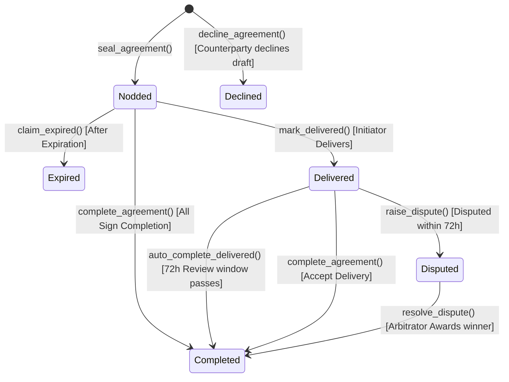
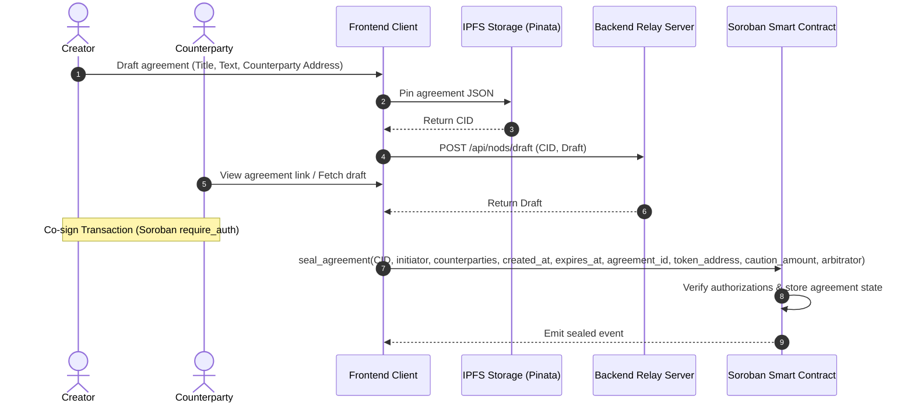

# Product Requirement Document (PRD): NOD — Decentralized Handshakes & Agreements (Stellar Edition)

## 1. Executive Summary
NOD is a decentralized platform that replaces informal, non-binding agreements (e.g., text messages, verbal handshakes) with cryptographically sealed, immutable digital agreements. By leveraging blockchain, off-chain IPFS storage, and Zero-Knowledge (ZK) cryptography, NOD provides a secure, tamper-proof, and private mechanism for two parties to establish trust.

This document details the product specifications transitioned to the **Stellar / Soroban** platform.

---

## 2. Core User Flows & System Architecture

### 2.1 Core Scenarios and the Sealing Flow
NOD supports four template scenarios to tailor agreements and financial requirements:
1.  **Freelancer/Client**: Proposes a project with caution deposits (escrow) and an optional arbitrator.
2.  **Friends (Social Repayment)**: Simple reputation-based social promises with no caution deposit.
3.  **Roommates (Shared Rules)**: Multi-party agreements requiring co-signatures from all housemates, with no deadline.
4.  **Small Vendor Deal**: High-stakes business agreements with caution deposits (escrow) and arbitration.

### 2.2 Sealing and Resolution Lifecycle
1.  **Initiation**: The initiator drafts an agreement, selects a template, specifies co-signers, and optionally configures caution deposits (escrow) and a trusted arbitrator address.
2.  **IPFS Upload**: The serialized JSON metadata (including terms, participants, template parameters, caution deposits, and arbitrator) is pinned to IPFS to generate an immutable Content Identifier (CID).
3.  **Relay Registry**: The draft is cached on the backend relay server to allow counterparties to find and review it.
4.  **Co-Signing & Sealing**: Participants co-sign the transaction using Freighter. The contract verifies all authorizations (`require_auth()`), pulls caution deposits into the escrow balance (if `caution_amount > 0`), and records the status as `Nodded`.
5.  **Delivery & Dispute Resolution (State Machine)**:
    *   **Delivery** *(Phase 1)*: Initiator marks work as `Delivered`, starting a 72-hour review window.
    *   **Auto-Completion** *(Phase 1)*: If the review window passes with no dispute, anyone can call `auto_complete_delivered()` to release deposits.
    *   **Dispute & Arbitration** *(Phase 2)*: Counterparty can call `raise_dispute()` within 72 hours, freezing funds. The nominated arbitrator calls `resolve_dispute()` to award the escrow pool to the winning party.
    *   **Expiry Penalty** *(Phase 2)*: If the deadline passes without delivery, counterparties call `claim_expired()` to collect the initiator's penalty deposit.

---

## 3. Scope & Phases

### 3.1 Phase 1: Hackathon Scope (Core Demo)
The primary goal for the hackathon is to have the end-to-end happy path operational on the Stellar Testnet:
1. **Soroban Contract Core**: Write and deploy `NodContract` containing `seal_agreement()`, `decline_agreement()`, `mark_delivered()`, `auto_complete_delivered()`, and basic escrow lock/release functionality.
2. **Wallet Integration**: Wire up Freighter wallet to sign and submit all core state transition transactions on Stellar Testnet.
3. **IPFS Pinning**: Connect the frontend to actual IPFS pinning (via Pinata) to register draft agreements.
4. **Relay API**: A backend endpoint (`POST /api/nods/draft`) to temporarily store drafts so they can be retrieved by counterparties.
5. **Direct Lookup & Verification**: Fetch agreements directly from Stellar Testnet via Horizon RPC and compare hashes for verification.

### 3.2 Phase 2: Post-Hackathon Roadmap (Advanced Arbitration & Privacy)
* **Escrow Disputes & Arbitration**: Implement dispute freezes via `raise_dispute()`, arbitrator nominations/resolution via `resolve_dispute()`, and expiry penalty disbursements via `claim_expired()`.
* **Multi-Party Roommate Co-Signing**: Expand the sealing flow to require co-signatures from N roommates.
* **Zero-Knowledge Circuits (Noir)**: Integrate ZK proofs to verify agreements privately on-chain.
* **Custom Horizon Listener**: Build a specialized event indexing listener to query history at scale.

---

## 4. Component Breakdown & Features

### 4.1 Smart Contracts (Stellar / Soroban / Rust)
* **Status Enum**:
  * `Awaiting` (0): Used strictly as a draft/relay-only concept in the frontend/relay API. On-chain agreements are never stored in the `Awaiting` state, as `seal_agreement()` transitions them directly to `Nodded`.
  * `Nodded` (1), `Completed` (2), `Declined` (3), `Expired` (4), `Delivered` (5), `Disputed` (6).
* **Agreement Storage**: Keyed by `Agreement(BytesN<32>)`. Stores:
  * `cid`: String (IPFS CID)
  * `initiator`: Address of the creator
  * `counterparties`: Vec of co-signer addresses
  * `status`: NodStatus enum
  * `created_at`: Creation timestamp
  * `expires_at`: Expiry timestamp
  * `token_address`: Option of the escrow Stellar Asset Contract (SAC) token address
  * `caution_amount`: Escrow deposit amount locked per participant
  * `completed_parties`: Vec of addresses that approved completion
  * `arbitrator`: Option of the nominated arbitrator's address
  * `delivered_at`: Delivery timestamp (starts the 72h review window)
* **Replay Protection**: Managed natively by Stellar/Soroban host framework (no manual nonce validation needed).
* **Authorization**: Uses Soroban's native multi-auth capabilities (`initiator.require_auth()`, `counterparty.require_auth()`, `arbitrator.require_auth()`).
* **State Operations**:
  * **Phase 1 Operations**:
    * `seal_agreement(...)`: Validates and co-signs agreement draft; pulls caution deposits into escrow if `caution_amount > 0`.
    * `complete_agreement(...)`: Marks agreement completed by a participant; releases escrow if all participants approve.
    * `decline_agreement(...)`: Transitions agreement to `Declined`.
    * `mark_delivered(...)`: Transitions status to `Delivered` and records `delivered_at`.
    * `auto_complete_delivered(...)`: Releases locked caution deposits back to participants if 72 hours pass without a dispute.
  * **Phase 2 Operations**:
    * `raise_dispute(...)`: Freezes escrow and transitions status to `Disputed` if called by a counterparty within 72 hours of delivery.
    * `resolve_dispute(...)`: Allows the nominated arbitrator to award the entire escrow pool to the selected winner.
    * `claim_expired(...)`: Refunds counterparties and awards them the initiator's penalty deposit if the deadline passes without delivery/completion.

### 4.2 ZK Circuits (Noir/Aztec) — *Prepared for Phase 2*
* **Noir Circuit (`main.nr`)**: Used to verify agreement details without disclosing them to the public blockchain network.
* **Private Inputs**:
  * `sig1`: Initiator Ed25519 signature (64 bytes).
  * `sig2`: Counterparty Ed25519 signature (64 bytes).
  * `text`: Raw agreement text/hash chunk (64 bytes).
  * `timestamp`: The private signature timestamp.
  * `nonce`: The private agreement nonce (32 bytes).
* **Public Inputs**:
  * `commitment`: Hash of the private agreement data (32 bytes).
  * `initiator_pub_key`: The public Stellar/Ed25519 address of the initiator (32 bytes).
  * `counterparty_pub_key`: The public Stellar/Ed25519 address of the counterparty (32 bytes).
  * `status_nodded`: Boolean indicating if the agreement is sealed (`true`).
  * `expires_at`: Agreement expiry timestamp.

### 4.3 Frontend (Next.js & Stellar Wallet Connect)
* **Framework**: Next.js 16 with Tailwind CSS v4 and Framer Motion.
* **Wallet Connection**: Connects to Stellar wallets (e.g., Albedo, Freighter, or Rabe) for transaction signing and invocation.
* **Pages**:
  * **Home Page**: Dashboard showing pending drafts, active, completed, declined, delivered, and disputed agreements.
  * **Create Page**: Scenario template selector (Freelancer, Friends, Roommates, Vendor Deal), dynamic co-signer array inputs for multi-party rules *(Phase 2)*, and an optional arbitrator nominee field *(Phase 2)*.
  * **Nod Detail Page (`/nod/[id]`)**: Detailed tracking of escrow caution pool, real-time review window timers, sign-off checklist for roommate co-signers *(Phase 2)*, and custom dispute/delivery/arbitrator dashboards *(Phase 1 for Delivery & Auto-complete; Phase 2 for Disputes & Arbitration)*.
  * **Verify Page**:
    * *Phase 1 Scope*: Input transaction hash or agreement ID to check sealed status, initiator, counterparties, arbitrator, delivery timestamp, and block logs directly from Stellar Testnet via Horizon RPC.
    * *Phase 2 Scope*: Accept local ZK proofs of agreements to verify authentic existence without exposing the underlying text or addresses.

---

## 5. Key Performance Indicators & Non-Functional Requirements
1. **Low Trust Overhead**: The relay server must never have access to private keys or the ability to modify agreement content (guaranteed by cryptographic signatures).
2. **Immutable Agreement Text**: Agreement text is stored off-chain on IPFS ensuring it cannot be changed once signed (CID changes if content changes).
3. **Selective Privacy**: Users can prove they signed an agreement matching a specific hash without disclosing who they signed it with or what it contains, using the Noir ZK prover.
