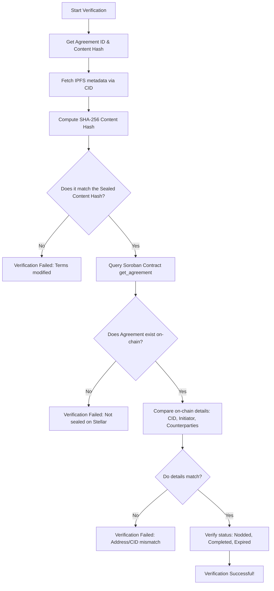

# NOD — Scenario User Flows and Verification Guide

This document describes the scenario templates, escrow designs, smart contract security patterns, and the procedure for third-party verification of agreements.

---

## 1. Scenario Templates & Parameters

NOD adapts its fields and actions based on the template selected at creation:

### Scenario 1 — Freelancer / Client (Escrow Lock & Arbitration)
*   **Template**: Freelancer
*   **Agreement**: *"Deliver logo set by Friday 6 PM. 3 concepts, 2 revision rounds."*
*   **Caution Money**: **Yes** (e.g., 50 XLM each)
*   **Deadline**: Friday 6 PM (Epoch timestamp)
*   **Participants**: 1 Initiator (Designer), 1 Counterparty (Client), 1 Nominated Arbitrator (Optional)
*   **Resolution Flow**:
    *   **Normal Completion**: Both parties mark complete. Escrow releases 50 XLM back to the Designer and 50 XLM back to the Client.
    *   **Delivery & Review Window**: Initiator marks the agreement as `Delivered`. This starts a 72-hour review window.
        *   **Accept Delivery / Auto-Complete**: If the Client accepts delivery or does nothing for 72 hours, anyone can call `auto_complete_delivered()`, releasing 50 XLM back to the Designer and 50 XLM back to the Client.
        *   **Dispute Raised**: Within the 72-hour window, the Client can call `raise_dispute()`, freezing the entire 100 XLM escrow pool and setting the status to `Disputed`.
    *   **Arbitration**: The nominated Arbitrator reviews the case and calls `resolve_dispute(winner)`. The entire pool (100 XLM) is awarded to the winner (either Designer or Client).
    *   **Failure / Expiry**: If the deadline passes without delivery or completion, the Client can call `claim_expired()` to claim the entire escrow pool (100 XLM).

### Scenario 2 — Friends (Informal Debt / Escrow-Less)
*   **Template**: Friends
*   **Agreement**: *"I'll pay you back ₹800 from concert tickets by next Sunday."*
*   **Caution Money**: **No** (0 XLM)
*   **Deadline**: Next Sunday 11:59 PM
*   **Participants**: 1 Initiator (Rahul), 1 Counterparty (Priya)
*   **Resolution Flow**:
    *   **Success**: Both mark complete. Status becomes `Completed`.
    *   **Expiry**: If Sunday passes without completion, the status automatically flags as `Expired` (on-chain/UI evidence of broken social promise).

### Scenario 3 — Roommates (Shared Rules / Multi-party Escrow-Less)
*   **Template**: Roommates
*   **Agreement**: *"No guests after midnight on weekdays. Agreed by all roommates."*
*   **Caution Money**: **No** (0 XLM)
*   **Deadline**: **None** (ongoing rule, `expires_at = 0`)
*   **Participants**: 1 Initiator (Aryan), N Counterparties (Sneha, Kabir)
*   **Resolution Flow**:
    *   Ongoing agreement. Stays in the `Nodded` state indefinitely. No completion or expiry possible.

### Scenario 4 — Small Vendor Deal (High-Stakes Escrow Lock & Arbitration)
*   **Template**: Vendor Deal
*   **Agreement**: *"Deliver 200 units of custom merchandise by March 15. ₹5000 upfront deposit confirmed."*
*   **Caution Money**: **Yes** (e.g., 200 XLM each)
*   **Deadline**: March 15 (Epoch timestamp)
*   **Participants**: 1 Initiator (Vendor), 1 Counterparty (Buyer), 1 Nominated Arbitrator (Optional)
*   **Resolution Flow**:
    *   **Normal Completion**: Both parties mark complete. Escrow releases 200 XLM to the Vendor and 200 XLM to the Buyer.
    *   **Delivery & Review Window**: Initiator marks as `Delivered`, initiating a 72-hour review window.
        *   **Accept Delivery / Auto-Complete**: If the Buyer accepts delivery or 72 hours pass with no dispute, calling `auto_complete_delivered()` releases 200 XLM to the Vendor and 200 XLM to the Buyer.
        *   **Dispute Raised**: The Buyer calls `raise_dispute()` within 72 hours of delivery, freezing the 400 XLM pool.
    *   **Arbitration**: The nominated Arbitrator decides the winner and calls `resolve_dispute(winner)`. The entire 400 XLM pool is sent to the winner.
    *   **Failure / Expiry**: If the deadline passes without delivery, the Buyer calls `claim_expired()` to claim the entire 400 XLM pool.

---

## 2. On-Chain Security Architecture

To guarantee the integrity of the locked funds, the smart contract (`contracts/src/contract.rs`) implements the following safety features:

1.  **Strict Authorization (`require_auth()`)**:
    *   The `seal_agreement` function requires signatures from the initiator AND all counterparties. Funds cannot be pulled from any wallet without explicit signed consent.
    *   The `complete_agreement` function requires the caller's auth. An agreement is only completed when all participants have signed their completion transaction.
    *   The `claim_expired` function checks that the caller is one of the counterparties. Initiators cannot claim locked deposits on expiry.
2.  **Escrow Isolation**:
    *   Locked tokens are held in the contract's own balance (isolated per agreement ID).
    *   The contract does not hold a global pool; transfers are strictly checked against the specific agreement's `caution_amount` record.
3.  **Proportional Multi-Party Expiry Payouts**:
    *   If multiple counterparties participate in a caution-money agreement, calling `claim_expired` refunds each counterparty's deposit and splits the initiator's lost caution money proportionally among all counterparties.
4.  **Secure Delivery & Dispute State Machine**:
    *   The `mark_delivered` function requires the initiator's signature (`agreement.initiator.require_auth()`) and transitions the contract to `Delivered`.
    *   The `raise_dispute` function can only be invoked by counterparties (`claimant.require_auth()`) within a strict 72-hour review window after delivery. It freezes funds by transitioning the contract to `Disputed`.
    *   The `resolve_dispute` function can ONLY be called by the designated arbitrator (`arb.require_auth()`), authorizing a payout of the entire escrow pool to the verified winner.
    *   The `auto_complete_delivered` function allows anyone to release deposits back to their respective owners, but only if the 72-hour review window has passed without any disputes being raised.

---

## 3. Third-Party Verification Guide

Because agreements are recorded immutably on Stellar and IPFS, any third party (e.g., mediator, auditor, or peer) can verify an agreement's integrity without relying on NOD's central interface.

### Verification Flow



### Step-by-Step Procedure

1.  **Retrieve IPFS Document**:
    *   Query the IPFS network for the agreement metadata using the `cid` (e.g., `https://ipfs.io/ipfs/<CID>`).
    *   The metadata is a JSON document containing:
        ```json
        {
          "text": "Deliver logo set by Friday 6 PM. 3 concepts, 2 revision rounds.",
          "creator": "GBUTN6...",
          "counterparties": ["GAODT4..."],
          "timestamp": "2026-06-13T22:00:00Z",
          "template": "freelancer",
          "cautionAmount": 50,
          "expiresAt": 1781373600,
          "arbitrator": "GATRU5..."
        }
        ```
2.  **Verify Content Hash**:
    *   Concatenate the fields to reproduce the verification string: `<text>|<creator>|<created_at>`. (e.g., `Deliver logo set...|GBUTN6...|2026-06-13T22:00:00Z`).
    *   Compute the SHA-256 hash. Ensure it matches the `Sealed Content Hash` displayed.
3.  **Query Stellar Testnet**:
    *   Use the Stellar Horizon API or Soroban RPC to call the `get_agreement` function of the contract `CCAM5XI53OMFPKIMRHKZJMSJXYXJAYMPPX7TG3TKJ5NKOPDSQEU4QIMV` with the `agreement_id`.
    *   Verify the return value:
        *   `status`: Confirm whether it is `1` (Nodded/Active), `2` (Completed), `3` (Declined), `4` (Expired), `5` (Delivered), or `6` (Disputed).
        *   `cid`: Verify the returned string matches the IPFS CID exactly.
        *   `initiator`/`counterparties`: Check that the participating addresses match the signed parties.
        *   `arbitrator`: Check that the nominated arbitrator address matches if set.
        *   `delivered_at`: Check delivery timestamp if status is `Delivered` or beyond.
